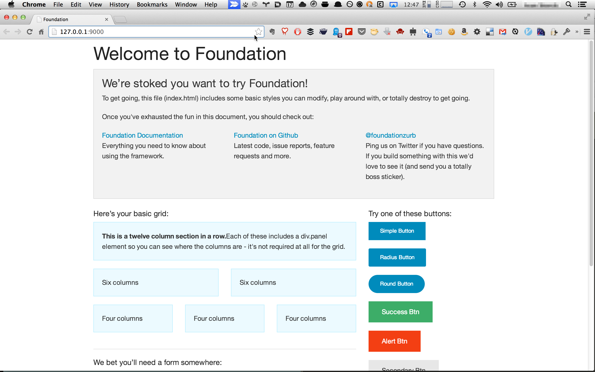
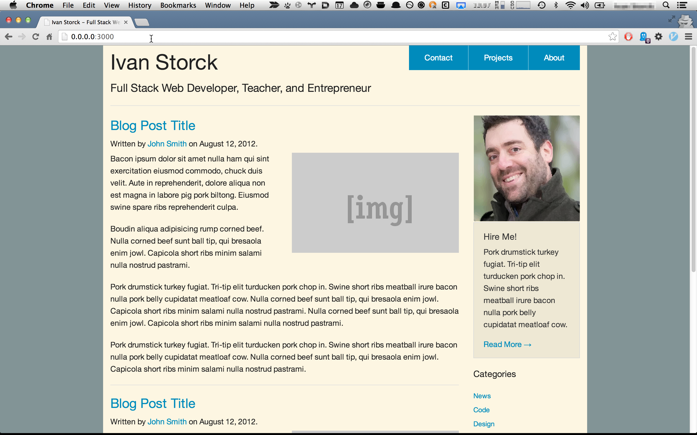

# Example Blog Layout and Tutorial

This is a simple blog made as teaching example.

## Made with:

- [Yeoman](http://yeoman.io/)
  - [generator-browserify](https://github.com/ivanoats/generator-browserify)
- [Zurb Foundation](https://github.com/zurb/foundation)
  - [Blog Template](http://foundation.zurb.com/templates.html)

## Other Technologies Used

- [Grunt](http://gruntjs.com/)
- [NPM](https://www.npmjs.org/)
- [Sass](http://sass-lang.com/) ([SCSS](http://sass-lang.com/guide))
- [SVG](https://developer.mozilla.org/en-US/docs/Web/SVG) (Headshot image of me)
  - [svgo](https://github.com/svg/svgo) (npm install -g svgo)

## Tutorial
### Prerequisites
- Node and NPM [installed](https://github.com/joyent/node/wiki/Installing-Node.js-via-package-manager).
  - I recommend `brew install nvm` on Mac OS X instead of `brew install node`.
   See the [nvm](https://github.com/creationix/nvm) README for more details.
- Yeoman and Grunt installed: `npm install -g yo grunt-cli`

### How I made this app
Grab my copy of generator-browserify (until [this pull request is closed](https://github.com/vincentmac/generator-browserify/pull/2)).

```
npm -g install https://github.com/ivanoats/generator-browserify.git
```

Generate the app skeleton

```
mkdir blog && cd blog
yo browserify
```

- Choose Grunt as the build system. 
- Choose Foundation as the front-end framework.
- Yes, you'd like to include Modernizr to support your grand-dad on IE8.
- No, let's skip [Jade](http://jade-lang.com/) templating for now.
- Choose Libsass as the sass compiler so that you don't need a Ruby dependency
  in your project
  
You'll see a lot of text scroll by, and on my system I saw the last lines like this:
```
grunt-sass@0.9.0 node_modules/grunt-sass
├── async@0.2.10
└── node-sass@0.7.0 (node-watch@0.3.4, colors@0.6.0-1, mkdirp@0.3.5, optimist@0.6.1, mocha@1.13.0)
```

Your directory listing should look something like this:

```
total 80
drwxr-xr-x   13 ivan  staff    442 Apr 17 12:40 .
drwxr-xr-x  256 ivan  staff   8704 Apr 17 12:36 ..
-rw-r--r--    1 ivan  staff     42 Apr 16 15:14 .bowerrc
-rw-r--r--    1 ivan  staff    214 Apr 16 15:14 .editorconfig
-rw-r--r--    1 ivan  staff     11 Apr 16 15:14 .gitattributes
-rw-r--r--    1 ivan  staff     65 Apr 16 15:14 .gitignore
-rw-r--r--    1 ivan  staff    390 Apr 16 15:14 .jshintrc
-rw-r--r--    1 ivan  staff  11094 Apr 17 12:40 Gruntfile.js
drwxr-xr-x    7 ivan  staff    238 Apr 17 12:40 app
-rw-r--r--    1 ivan  staff    213 Apr 16 15:14 bower.json
drwxr-xr-x    2 ivan  staff     68 Apr 17 12:40 dist
drwxr-xr-x   32 ivan  staff   1088 Apr 17 12:40 node_modules
-rw-r--r--    1 ivan  staff   1277 Apr 17 12:40 package.json
```

Now type `grunt server` to launch the app in a web browser. You should see something
like this: 



That's great but let's start with a simpler blog layout: Go to
 [http://foundation.zurb.com/templates.html](http://foundation.zurb.com/templates.html)

and download the blog layout HTML. Put that in the body tag of `app/index.html` in
your project.

You can now start customizing your blog with the following files:
- app/index.html
- app/scss/app.scss
- app/images

Here's what I did:



Go to town! This generator also includes [BackboneJS](http://backbonejs.org/) so you can even make your 
blog a single-page app. 

# TODO
- Add a simple MongoDB / Express app as the blog's REST API
- Build out the site with BackboneJS
- Add some CasperJS ZombieJS or SuperAgent tests. 

# Contributing

Tested Pull-Requests welcome! I will list you as a contributor.
